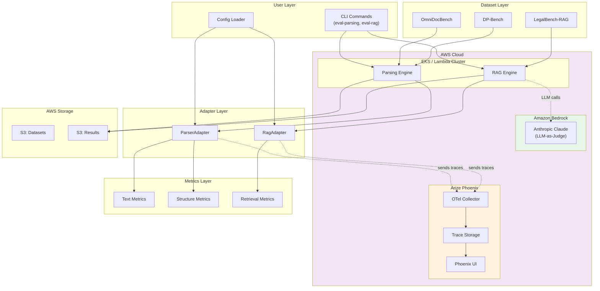
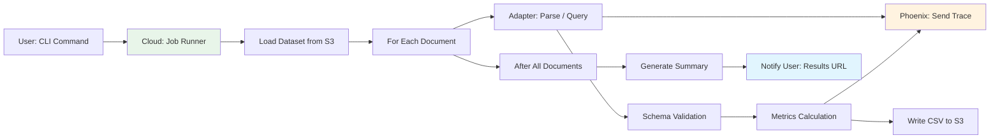

# Architecture Overview

## 1. System Purpose

Eval-Harness is a cloud-based evaluation framework for document parsing and RAG systems. It runs on AWS and provides:

- **Standardized metrics** for comparing system quality
- **Public benchmark integrations** (OmniDocBench, DP-Bench, LegalBench-RAG)
- **Extensible adapter pattern** for plugging in custom systems
- **Built-in observability** via Arize Phoenix telemetry
- **LLM-powered evaluation** using Amazon Bedrock (Anthropic Claude)

## 2. Cloud Architecture

## 3. Core Components

### 3.1 Cloud Execution Layer

The framework runs on AWS using either:

- **EKS (Elastic Kubernetes Service)** for large-scale batch evaluations
- **AWS Lambda** for on-demand, single-document evaluations

Choice depends on workload: EKS for throughput, Lambda for cost efficiency on sporadic usage.

### 3.2 Telemetry with Arize Phoenix

Every evaluation run emits OpenTelemetry traces to Arize Phoenix:

- **Document processing latency** (end-to-end per document)
- **Metric calculation time** (per metric type)
- **LLM-as-judge calls** (prompt tokens, completion tokens, latency)
- **Error rates** (parse failures, validation errors)

Phoenix UI runs as a sidecar service, accessible via port 6006 (local) or cloud-hosted URL.

### 3.3 LLM-as-Judge with Bedrock

For RAG evaluation, Anthropic Claude (via Amazon Bedrock) judges:

- **Answer supported**: Does the answer cite retrieved evidence?
- **Citation quality**: Are citations valid and relevant?

Benefits over heuristic checks: more nuanced judgment, better handling of ambiguous cases.

### 3.4 Adapter Layer

Decouples user systems from evaluation framework. Your parser/RAG produces any format; adapter validates and normalizes.

No code changes required on your side.

### 3.5 Metrics Layer

| Category | Metrics | Purpose |
|----------|---------|---------|
| Text Similarity | NID, BLEU, METEOR | Extracted text quality |
| Structure | TEDS, MHS, Layout mAP | Layout accuracy |
| Reading Order | ARD | Element sequencing |
| Retrieval | Recall@k, Precision@k | RAG chunk quality |
| Answer | F1, Exact Match | Generated answer accuracy |

## 4. Key Design Decisions

### 4.1 Why Cloud-First?

Local execution limits scale. Cloud deployment provides:

- **Horizontal scaling** — process thousands of documents in parallel
- **Managed infrastructure** — no server maintenance
- **Built-in observability** — CloudWatch, X-Ray integration
- **Cost optimization** — spot instances for batch jobs, Lambda for sporadic usage

### 4.2 Why Arize Phoenix?

Phoenix provides:

- **LLM-specific tracing** — prompt/completion token counts, costs
- **Visualization** — dependency graphs, latency heatmaps
- **Local development** — run Phoenix locally, same stack as production
- **OpenTelemetry native** — standard protocol, no vendor lock-in

### 4.3 Why Bedrock Anthropic?

Alternatives considered: OpenAI API, local Llama models, heuristic-only evaluation.

Chosen Bedrock because:

- **No API keys to manage** — IAM-based auth
- **Regional proximity** — data stays in chosen AWS region
- **Claude quality** — strong at citation judgment tasks
- **Unified billing** — on AWS invoice, separate vendor

### 4.4 Why Adapter Pattern?

Three options considered:

1. **Modify user code** — invasive, high friction
2. **Write custom metrics per system** — unmaintainable
3. **Adapter with schema validation** — chosen

Benefits:
- Zero user code changes
- Single metrics implementation
- Fail-fast on malformed output

### 4.5 Why Incremental Results?

Evaluation on large datasets takes time. Writing results incrementally:

- **Progress visibility** — see results during run
- **Crash recovery** — partial results preserved
- **No memory buildup** — never accumulate all results in RAM

## 5. Technology Stack

| Layer | Technology | Rationale |
|-------|------------|-----------|
| Compute | EKS / Lambda | Scale or save |
| Storage | S3 | Durable, cheap, integrates with everything |
| LLM | Bedrock Claude | IAM auth, regional, high quality |
| Telemetry | Arize Phoenix + OpenTelemetry | LLM-aware, standard protocol |
| Orchestration | AWS Step Functions (optional) | Long-running workflow coordination |
| Container | ECR + Docker | Reproducible builds |
| Language | Python 3.13+ | Rich ecosystem |
| Package | uv | Fast dependency resolution |
| Schema | JSON Schema | Explicit, toolable |
| Validation | jsonschema | Reference implementation |

## 6. Data Flow Summary

## 7. Deployment Models

### 7.1 Development

- Run locally: `uv run eval-parsing`
- Phoenix sidecar: `docker run -p 6006:6006 arizephoenix/phoenix`
- Traces to local Phoenix, results to local `results/`

### 7.2 Production (EKS)

- Deploy container to EKS cluster
- Horizontal Pod Autoscaler scales based on queue depth
- S3 for datasets and results
- Cloud-hosted Phoenix (or EKS deployment)
- CloudWatch for metrics and alerts

### 7.3 Serverless (Lambda)

- Single Lambda function handles eval request
- S3 event trigger for new documents
- State stored in S3, DynamoDB for job tracking
- Pay-per-invocation, no idle costs

## 8. Security and Privacy

### 8.1 Data Residency

All processing in chosen AWS region. No data crosses regions unless explicitly configured.

### 8.2 IAM-Based Auth

No API keys stored. Bedrock access via IAM roles. S3 access via IAM policies.

### 8.3 Network Isolation

VPC configuration options:
- Public endpoints for development
- VPC endpoints for production (no internet gateway)
- PrivateLink for S3 and Bedrock access

### 8.4 Audit Logging

CloudTrail logs all API calls. X-Ray traces request paths. Phoenix maintains trace history.

## 9. Extensibility

### 9.1 Add Custom Parser

Write your parse function. Wrap in adapter. Adapter handles validation and telemetry.

### 9.2 Add Custom RAG System

Write your query function. Wrap in adapter. Adapter handles validation and telemetry.

### 9.3 Add New Dataset

Implement loader following iterator pattern. Register in CLI. No framework changes needed.

## 10. Related Documents

- [002-Data-Flow-Detailed](002-data-flow-detailed.md) — Step-by-step execution flow
- [003-Schema-Design](003-schema-design.md) — Data contracts and validation
- [004-Metrics-Reference](004-metrics-reference.md) — All metrics explained
- [005-Adapter-Implementation](005-adapter-implementation.md) — Integration guide
