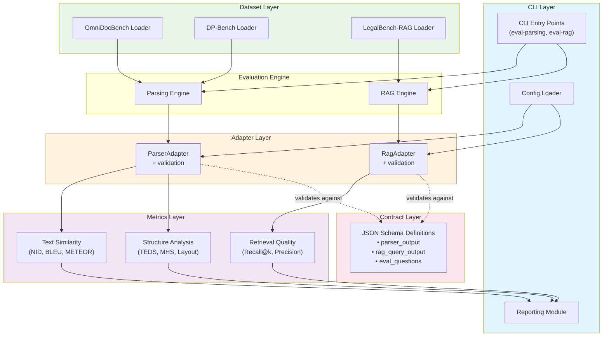

# Architecture Overview

**Status:** Proposed
**Author:** Eval-Harness Team
**Date:** 2025-01-19

## 1. System Purpose

Eval-Harness is a local evaluation framework for document parsing and RAG (Retrieval-Augmented Generation) systems. It provides:

1. **Standardized metrics** for comparing parser/RAG quality
2. **Public benchmark integrations** (OmniDocBench, DP-Bench, LegalBench-RAG)
3. **Extensible adapter pattern** for plugging in custom systems
4. **Local-only execution** — no data leaves the user's machine

## 2. High-Level Architecture



## 3. Core Components

### 3.1 CLI Entry Points

Two primary commands:

| Command | Purpose | Entry Point |
|---------|---------|-------------|
| `eval-parsing` | Evaluate document parsers | `runners/run_parsing_eval.py` |
| `eval-rag` | Evaluate RAG systems | `runners/run_rag_eval.py` |

### 3.2 Adapter Layer

**Purpose:** Decouple user systems from evaluation framework via schema validation.

**Pattern:**
```python
# User provides any function matching signature
def my_parser(pdf_path: Path) -> dict:
    return {...}  # Any format

# Adapter wraps and validates
adapter = ParserAdapter(my_parser)
output = adapter.parse(pdf_path)  # Guaranteed schema-conformant
```

**Benefits:**
- Users don't modify their code
- Framework gets standardized input
- Schema validation catches errors early

### 3.3 Metrics Layer

Organized by evaluation domain:

```
metrics/
├── parsing/
│   ├── text_similarity.py    → NID, BLEU, METEOR
│   ├── structure_recall.py   → Layout mAP, Bbox precision
│   ├── reading_order.py      → ARD (Average Rank Distance)
│   ├── table_teds.py         → TEDS (Tree Edit Distance)
│   └── mhs.py                → MHS (Markdown Hierarchical Similarity)
└── (future) retrieval/       → Recall@k, Precision@k, Citation quality
```

### 3.4 Dataset Layer

**Iterator Pattern:** All loaders yield items one at a time (memory efficient).

```python
def load_omnidocbench(root: Path) -> Iterator[tuple]:
    for page in dataset:
        yield (query_id, pdf_path, ground_truth)
```

**Supported Benchmarks:**

| Benchmark | Domain | Format | Size |
|-----------|--------|--------|------|
| OmniDocBench | Multi-modal parsing | JSON + images | 593 pages (EN-only) |
| DP-Bench | Digital PDF parsing | JSON + PDFs | 1,052 docs |
| LegalBench-RAG | Legal Q&A | JSON + text | 6,889 queries |

## 4. Data Flows

### 4.1 Parsing Evaluation Flow

```
┌─────────┐     ┌────────────┐     ┌──────────────┐     ┌───────────┐
│ Dataset │ ──▶ │   Runner    │ ──▶ │   Adapter    │ ──▶ │  Parser   │
│ Loader  │     │ (CLI entry) │     │ + Validation │     │ (User's)  │
└─────────┘     └────────────┘     └──────┬───────┘     └───────────┘
                                            │
                                            ▼
                                    ┌───────────────┐
                                    │ parser_output │
                                    │  (validated)  │
                                    └───────┬───────┘
                                            │
        ┌───────────────────────────────────┼───────────────────────────┐
        │                                   ▼                           │
        │                          ┌──────────────┐                     │
        │                          │ Markdown     │                     │
        │                          │ Converter    │                     │
        │                          └───────┬──────┘                     │
        │                                  │                            │
        ▼                                  ▼                            ▼
┌─────────────┐                  ┌─────────────┐              ┌─────────────┐
│  Text       │                  │  Structure  │              │   Order    │
│  Metrics    │                  │  Metrics    │              │  Metrics   │
│ (NID/BLEU)  │                  │ (TEDS/MHS)  │              │   (ARD)    │
└──────┬──────┘                  └──────┬──────┘              └──────┬──────┘
       │                                │                             │
       └────────────────────────────────┼─────────────────────────────┘
                                        ▼
                               ┌───────────────┐
                               │  CSV + JSON   │
                               │   Results     │
                               └───────────────┘
```

### 4.2 RAG Evaluation Flow

```
┌─────────┐     ┌────────────┐     ┌──────────────┐     ┌───────────┐
│ Dataset │ ──▶ │   Runner    │ ──▶ │   Adapter    │ ──▶ │   RAG     │
│ Loader  │     │ (CLI entry) │     │ + Validation │     │  System   │
└─────────┘     └────────────┘     └──────┬───────┘     └───────────┘
                                            │
                                            ▼
                                    ┌───────────────┐
                                    │ rag_query_    │
                                    │   output      │
                                    │  (validated)  │
                                    └───────┬───────┘
                                            │
        ┌───────────────────────────────────┼───────────────────────────┐
        │                                   │                           │
        ▼                                   ▼                           ▼
┌─────────────┐                  ┌─────────────┐              ┌─────────────┐
│  Retrieval  │                  │   Answer    │              │  Citation  │
│  Metrics    │                  │  Metrics    │              │  Metrics   │
│(Recall@k)   │                  │  (F1/EM)    │              │  (Prec@k)   │
└──────┬──────┘                  └──────┬──────┘              └──────┬──────┘
       │                                │                             │
       └────────────────────────────────┼─────────────────────────────┘
                                        ▼
                               ┌───────────────┐
                               │  CSV + JSON   │
                               │   Results     │
                               └───────────────┘
```

## 5. Key Design Decisions

### 5.1 Why Adapter Pattern?

**Problem:** Different parsers/RAG systems produce different output formats.

**Options:**
1. Modify each system to produce our format — **invasive**
2. Write custom metric for each system — **impractical**
3. Adapter pattern — **chosen**

**Rationale:**
- Zero modifications to user code
- Single metrics implementation
- Schema validation catches errors

### 5.2 Why JSON Schema Contracts?

**Benefits:**
- **Explicit documentation** — schema IS the spec
- **Runtime validation** — catch bad data early
- **Version management** — `schema_version` field
- **Tooling support** — generate validators, docs

### 5.3 Why Iterator-Based Datasets?

**Decision:** All loaders use `Iterator[T]` not `List[T]`.

**Rationale:**
- **Memory efficiency** — process 1 document at a time
- **Early termination** — stop on `--limit` without loading all
- **Incremental output** — write CSV row by row

### 5.4 Why Incremental CSV Writing?

**Design:** Open file once, append each result, flush immediately.

**Benefits:**
- **Progress visibility** — see results during long runs
- **Crash recovery** — partial results preserved
- **No memory buildup** — never accumulate all results

### 5.5 Why Separate `*_s` Metrics?

**Observation:** Some documents don't have all element types (tables, headings).

**Design:** Compute metrics with and without sparse elements.

| Metric | Includes | Use Case |
|--------|----------|----------|
| `nid` | All elements | Overall quality |
| `nid_s` | Sparse excluded | Fair comparison when doc lacks tables |

## 6. Technology Stack

| Component | Technology | Rationale |
|-----------|------------|-----------|
| Language | Python 3.13+ | Rich ecosystem, async support |
| Package Manager | `uv` | Fast dependency resolution |
| Schema | JSON Schema | Standard, tooling support |
| Validation | `jsonschema` | Reference implementation |
| CLI | `argparse` | Built-in, sufficient |
| CSV Output | `csv` module | Incremental writes |
| Metrics | `sacrebleu`, `rapidfuzz`, `apted` | Optimized implementations |
| Vector Store | `chromadb` (stub only) | Local, embeddable |
| LLM | OpenAI, Anthropic (stub only) | RAG evaluation |

## 7. Extensibility Points

### 7.1 Adding a New Parser

```python
# 1. Implement parse function
def my_parser(pdf_path: Path) -> dict:
    return {...}

# 2. Create adapter
adapter = ParserAdapter(my_parser)

# 3. Run evaluation
output = adapter.parse(pdf_path)  # Auto-validated
```

### 7.2 Adding a New Dataset

```python
# 1. Create loader in datasets/
def load_my_dataset(root: Path) -> Iterator[tuple]:
    for item in dataset:
        yield (query_id, doc_path, ground_truth)

# 2. Register in datasets/__init__.py
__all__ = ["load_my_dataset", ...]

# 3. Add to CLI choices
parser.add_argument("--dataset", choices=[..., "my_dataset"])
```

### 7.3 Adding a New Metric

```python
# 1. Implement in metrics/parsing/
def my_metric(gold: str, pred: str) -> float:
    ...

# 2. Import in runner
from eval_harness.metrics.parsing import my_metric

# 3. Add to CSV columns and calculation
```

## 8. Security and Privacy

### 8.1 Local-Only Design

**Principle:** No data leaves user's machine.

**Enforcement:**
- No telemetry
- No cloud dependencies (except user-provided API keys)
- Dataset loaders read from local filesystem

### 8.2 API Key Handling

**Pattern:**
- Read from `.env` file
- Pass via environment variables
- Never log or include in results

## 9. Performance Considerations

| Aspect | Target | Strategy |
|--------|--------|----------|
| Parsing | ~250ms/doc | Cached models, lazy loading |
| RAG | ~2-3s/query | Vector index, batch embedding |
| Memory | <2GB baseline | Iterator pattern, streaming |
| Disk | Incremental | Append-only CSV writes |

## 10. Related Documents

- [002-Data-Flow-Detailed](002-data-flow-detailed.md)
- [003-Schema-Design](003-schema-design.md)
- [004-Metrics-Reference](004-metrics-reference.md)
- [005-Adapter-Implementation](005-adapter-implementation.md)
