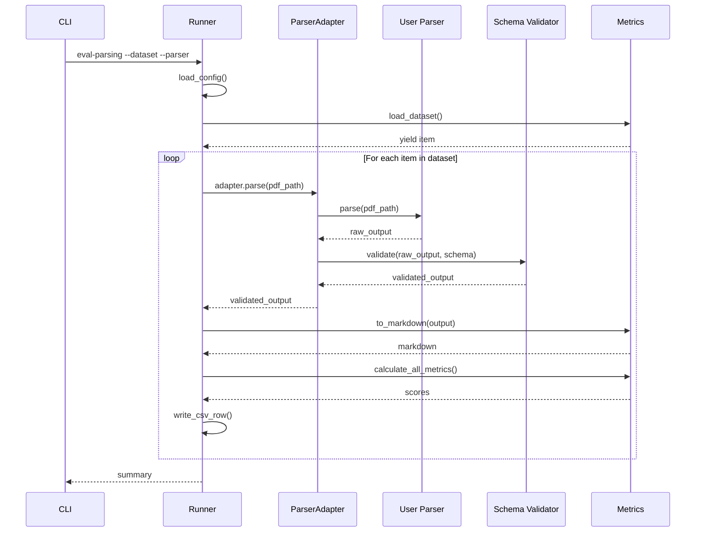
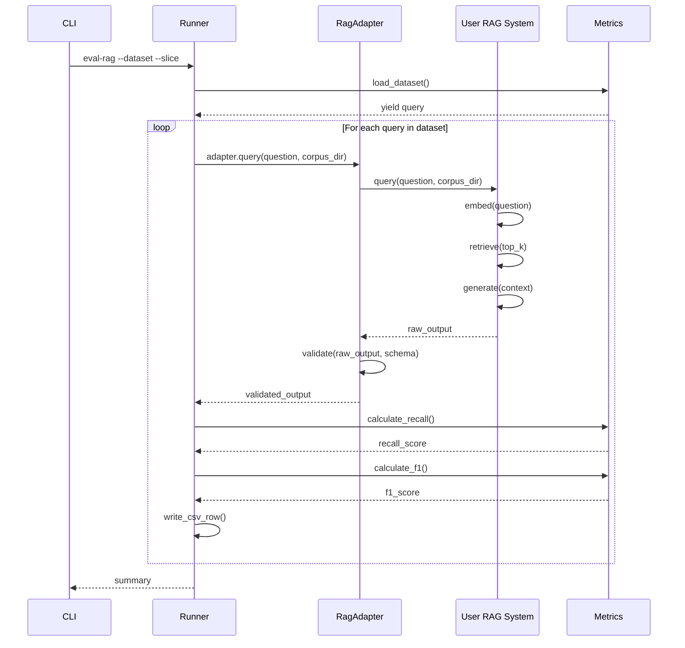
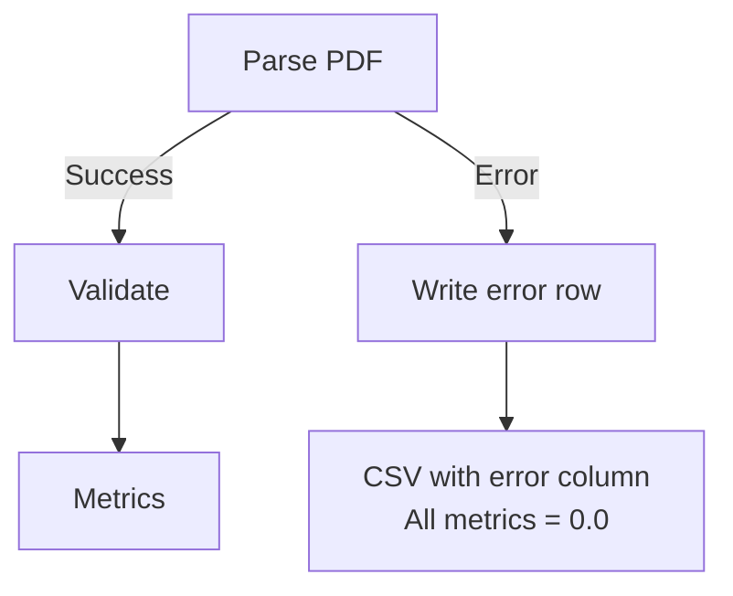
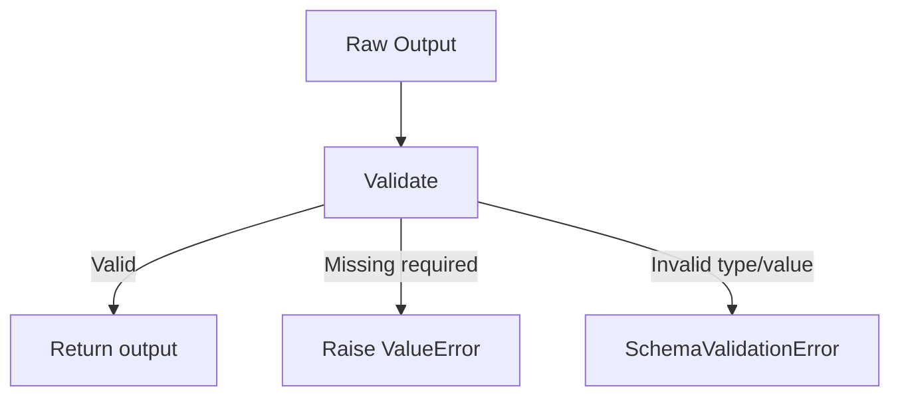

# Data Flow Detailed

**Status:** Proposed
**Author:** Eval-Harness Team
**Date:** 2025-01-19

## 1. Parsing Evaluation Flow

### 1.1 Sequence Diagram



### 1.2 Data Transformations

**Step 1: Raw Dataset Item**
```json
{
  "layout_dets": [
    {"category_type": "text_block", "text": "...", "order": 0, ...}
  ],
  "page_info": {"page_no": 0, "image_path": "page_001.png", ...}
}
```

**Step 2: Gold Text Extraction**
```
Concatenated text in reading order: "Block 1 text. Block 2 text."
```

**Step 3: Parser Raw Output** (user-provided, any format)
```json
{
  "pages": [...],
  "elements": [...],
  "metadata": {...}
}
```

**Step 4: Validated Parser Output** (after adapter)
```json
{
  "schema_version": "1.0.0",
  "parser_version": "1.0.0",
  "source": {"doc_id": "...", "filename": "..."},
  "elements": [
    {
      "element_id": "elem_0",
      "type": "paragraph",
      "text": "...",
      "page_index": 0,
      "char_span": [0, 100],
      "bbox": {"x0": 10, "y0": 20, "x1": 100, "y1": 30}
    }
  ]
}
```

**Step 5: Markdown Conversion**
```markdown
Extracted text from predicted elements, preserving structure.
```

**Step 6: Metric Scores**
```json
{
  "nid": 0.85,
  "teds": 0.72,
  "mhs": 0.90,
  "ard": 0.15,
  "bleu": 0.65,
  "meteor": 0.58
}
```

**Step 7: CSV Row**
```csv
query_id,error,nid,nid_s,teds,teds_s,mhs,mhs_s,ard,bleu,meteor
omnidocbench_0,,0.85,0.87,0.72,0.75,0.90,0.92,0.15,0.65,0.58
```

## 2. RAG Evaluation Flow

### 2.1 Sequence Diagram



### 2.2 Data Transformations

**Step 1: Raw Dataset Item**
```json
{
  "query_id": "cuad_0",
  "question": "What is the expiration date?",
  "gold_spans": [[150, 250], [400, 450]],
  "gold_answer": "This agreement expires on..."
}
```

**Step 2: RAG Query**
```
User question: "What is the expiration date?"
Corpus directory: /path/to/legal/documents
```

**Step 3: RAG Raw Output** (user-provided, any format)
```json
{
  "retrieved": [...],
  "answer": {...},
  "timing": {...}
}
```

**Step 4: Validated RAG Output** (after adapter)
```json
{
  "answer": {
    "text": "The agreement expires on...",
    "answer_supported": true,
    "citations": [{"chunk_ids": ["doc1_chunk5"]}]
  },
  "retrieved_chunks": [
    {
      "chunk_id": "doc1_chunk5",
      "score": 0.85,
      "char_span": [145, 255]
    }
  ],
  "timings_ms": {
    "retrieval": 50,
    "generation": 500,
    "total": 550
  }
}
```

**Step 5: Metric Calculation**
- **Recall@k**: Check if any retrieved chunk overlaps gold spans
- **Precision@k**: Relevant chunks / k
- **F1**: Token overlap between gold and predicted answers
- **Citation Precision**: Valid citations / total citations

**Step 6: CSV Row**
```csv
query_id,recall_at_k,precision_at_k,f1_score,answer_supported,citation_precision,...
cuad_0,1.0,0.2,0.75,True,1.0,...
```

## 3. Error Handling Flow

### 3.1 Parser Error Handling



**Error Row Format:**
```csv
query_id,error,nid,nid_s,...
doc_001,"PDF file corrupted",0.0,0.0,...
```

### 3.2 Schema Validation Error



## 4. Output File Structure

### 4.1 CSV File (Incremental)

**Naming:** `{dataset}_{parser|slice}_results_{timestamp}.csv`

**Structure:**
- Header written on first run
- Rows appended one at a time
- File flushed after each write
- Can resume after interruption

**Example:**
```
results/omnidocbench_docling_results_20250119_143022.csv
```

### 4.2 JSON Summary (Final)

**Naming:** Same base as CSV, `.json` extension

**Structure:**
```json
{
  "dataset": "omnidocbench",
  "parser": "docling",
  "timestamp": "20250119_143022",
  "csv_file": "omnidocbench_docling_results_20250119_143022.csv",
  "metrics_avg": {
    "nid": 0.8234,
    "teds": 0.6156,
    ...
  },
  "total_processed": 500,
  "errors": 5
}
```

## 5. Memory Management

### 5.1 Iterator Pattern Benefits

**Without Iterator:**
```python
# BAD: Loads entire dataset into memory
dataset = list(load_dataset())  # All items in RAM
for item in dataset:
    process(item)
```

**With Iterator:**
```python
# GOOD: One item at a time
for item in load_dataset():  # Generator
    process(item)
    # Item garbage collected after processing
```

### 5.2 Streaming CSV Writes

**Pattern:**
```python
with open(output_file, 'a') as f:
    writer = csv.DictWriter(f, fieldnames=...)
    writer.writeheader()

    for item in dataset:
        result = process(item)
        writer.writerow(result)
        f.flush()  # Immediate write, no buffering
```

**Benefits:**
- No accumulated results in memory
- Visible progress during long runs
- Crash recovery

## 6. Related Documents

- [001-Architecture-Overview](001-architecture-overview.md)
- [003-Schema-Design](003-schema-design.md)
