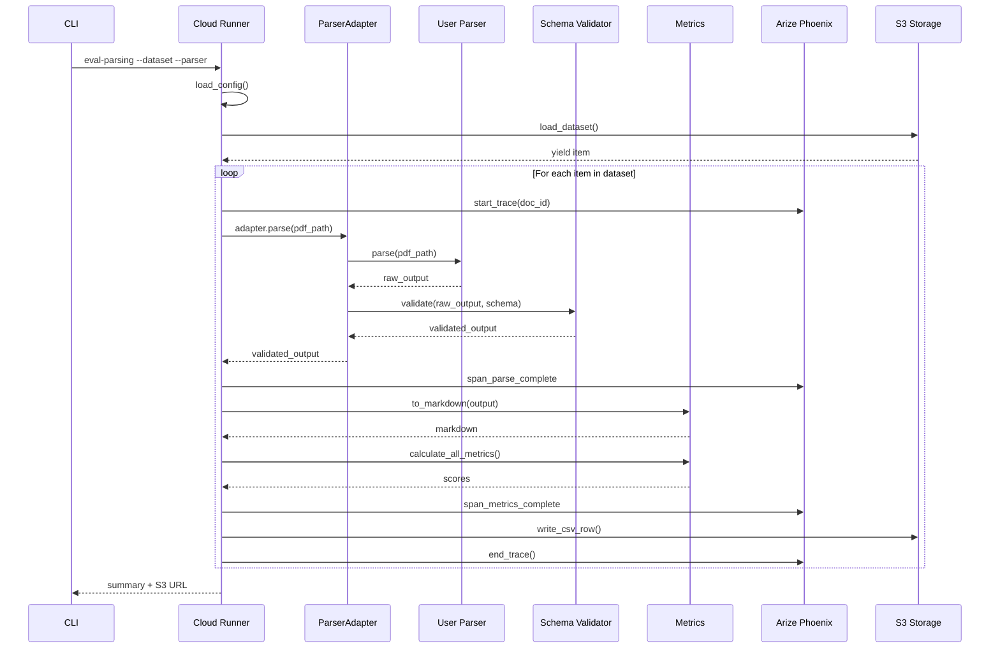
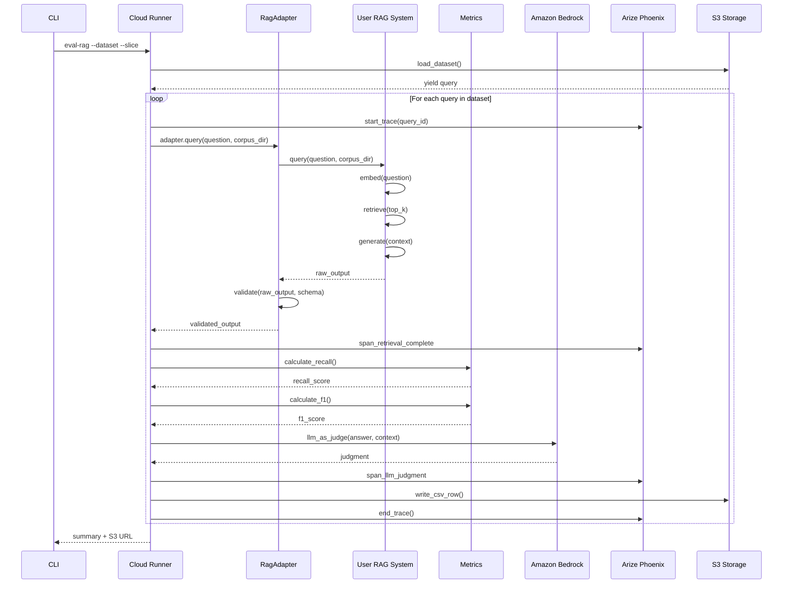
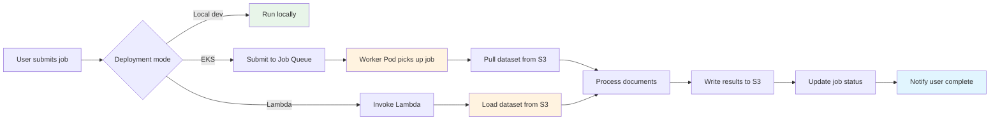
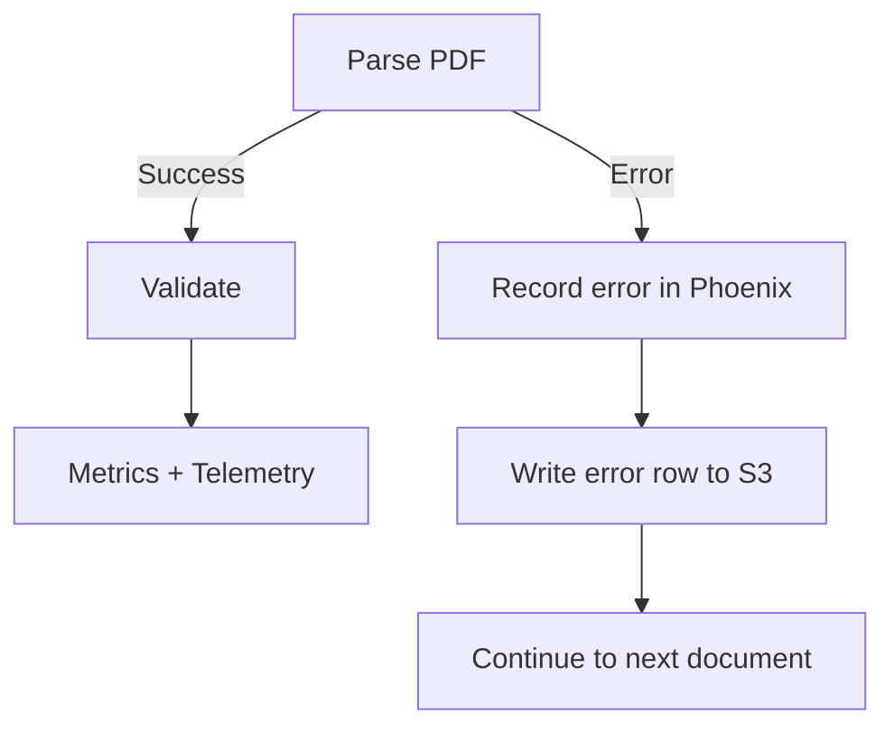
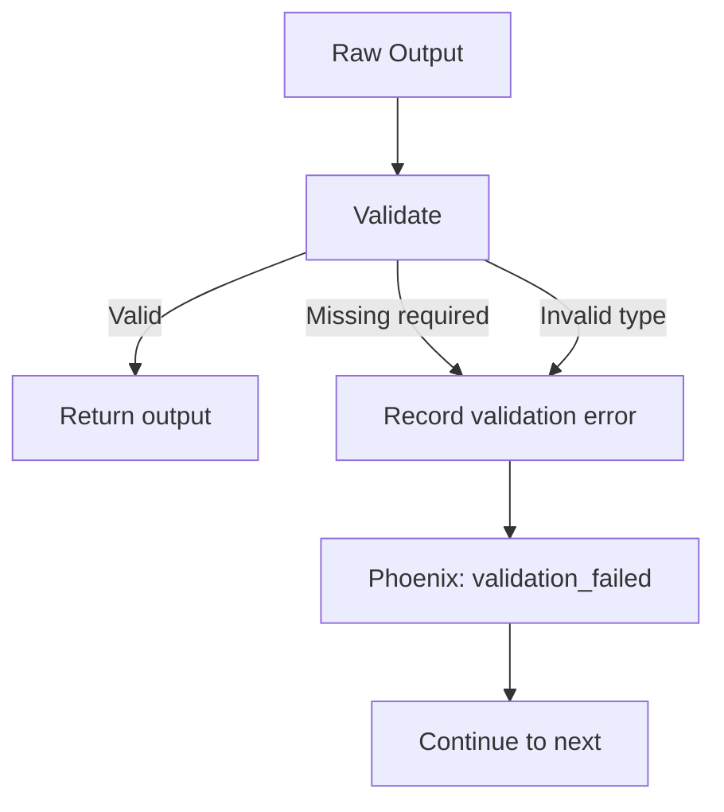
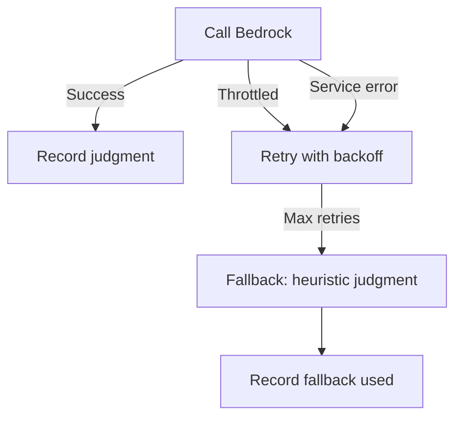

# Data Flow Detailed

**Status:** Proposed
**Author:** Eval-Harness Team
**Date:** 2025-01-19

## 1. Parsing Evaluation Flow

### 1.1 Sequence Diagram



### 1.2 Data Transformations

**Step 1: Raw Dataset Item (from S3)**
Dataset loaded from S3 contains ground truth: layout detections, page info, text annotations.

**Step 2: Gold Text Extraction**
Concatenated text in reading order from the ground truth annotations.

**Step 3: Parser Raw Output**
Your parser produces output in whatever format it naturally returns.

**Step 4: Validated Parser Output**
Adapter validates and normalizes to standard schema with document metadata, pages, and elements.

**Step 5: Markdown Conversion**
Extracted text converted to markdown for text similarity metrics.

**Step 6: Metric Scores**
Calculated scores for NID, TEDS, MHS, ARD, BLEU, METEOR.

**Step 7: CSV Row**
One row per document with all metrics as columns, written to S3.

### 1.3 Telemetry Emitted

For each document, Phoenix receives:

| Span | Attributes |
|------|------------|
| `parse_document` | doc_id, parser_name, latency_ms, status |
| `validate_schema` | schema_version, is_valid, error (if any) |
| `calculate_metrics` | metric_name, value, latency_ms |
| `write_result` | output_path, bytes_written |

## 2. RAG Evaluation Flow

### 2.1 Sequence Diagram



### 2.2 Data Transformations

**Step 1: Raw Dataset Item (from S3)**
Query with question, gold answer, and supporting evidence spans.

**Step 2: RAG Query**
Your RAG system receives the question and corpus directory.

**Step 3: RAG Raw Output**
Your RAG returns retrieved chunks and generated answer.

**Step 4: Validated RAG Output**
Adapter validates structure includes answer with supported flag, retrieved chunks with scores, citations, and timing breakdown.

**Step 5: Metric Calculation**
- Recall@k: Did any retrieved chunk overlap gold evidence?
- Precision@k: How many retrieved chunks were relevant?
- F1: Token overlap between gold and predicted answers
- LLM judgment: Is answer supported by citations?

**Step 6: CSV Row**
One row per query with all metrics and timings, written to S3.

### 2.3 Telemetry Emitted

For each query, Phoenix receives:

| Span | Attributes |
|------|------------|
| `rag_query` | query_id, corpus_name, latency_ms |
| `retrieval` | top_k, retrieval_ms, chunk_ids |
| `generation` | model_name, input_tokens, output_tokens, generation_ms |
| `llm_judge` | judge_model, prompt_tokens, judgment, latency_ms |
| `metrics_calc` | metric_name, value, latency_ms |

## 3. Cloud Execution Flow

### 3.1 Job Submission



### 3.2 Scaling Behavior

| Deployment | Scales On | Max Concurrency | Cost Model |
|------------|-----------|-----------------|------------|
| Local | N/A | 1 | Free (your machine) |
| EKS | Queue depth | Configurable (HPA) | Pods per hour |
| Lambda | Invocations | 1000 (default) | Per invocation + duration |

### 3.3 Fault Tolerance

- **Pod/Lambda restart**: Job status tracked in DynamoDB, resumes from last checkpoint
- **S3 write failures**: Retries with exponential backoff
- **Bedrock throttling**: Automatic retry with jitter
- **Phoenix unavailable**: Traces buffered, sent when service recovers

## 4. Error Handling Flow

### 4.1 Parser Error Handling



Error row includes error message, metrics set to null.

### 4.2 Schema Validation Error



### 4.3 LLM Judge Error



## 5. Output File Structure

### 5.1 S3 Output

**Location pattern:**
```
s3://bucket-name/results/
  ├── {dataset}_{parser}_{timestamp}.csv
  └── {dataset}_{parser}_{timestamp}_summary.json
```

**CSV Structure:**
- Header written on first document
- Rows appended incrementally
- File flushed after each write
- Can resume after interruption

**Summary JSON:**
Contains dataset info, metrics averages, totals, and Phoenix UI link.

### 5.2 Phoenix Trace Access

Each job run generates a trace ID. Access via:
- Phoenix UI: direct link to trace
- API: query by trace_id or job_id
- CloudWatch Logs: trace_id in log entries

## 6. Memory and Performance

### 6.1 Iterator Pattern Benefits

Processing one document at a time means:
- Constant memory usage regardless of dataset size
- No need to load entire dataset into RAM
- Graceful handling of datasets larger than compute capacity

### 6.2 Streaming Writes

Each result written immediately to S3:
- Progress visible in S3 as files grow
- Crash recovery: partial results preserved
- No memory accumulation

### 6.3 Performance Targets

| Operation | Target | Strategy |
|-----------|--------|----------|
| Parse per document | <500ms | Optimized parser, cached models |
| Metrics calculation | <100ms | Efficient algorithms, lazy eval |
| LLM judgment | <3s | Claude Sonnet, prompt caching |
| S3 write | <50ms | Multipart upload, retries |

## 7. Related Documents

- [001-Architecture-Overview](001-architecture-overview.md)
- [003-Schema-Design](003-schema-design.md)
- [005-Adapter-Implementation](005-adapter-implementation.md)
