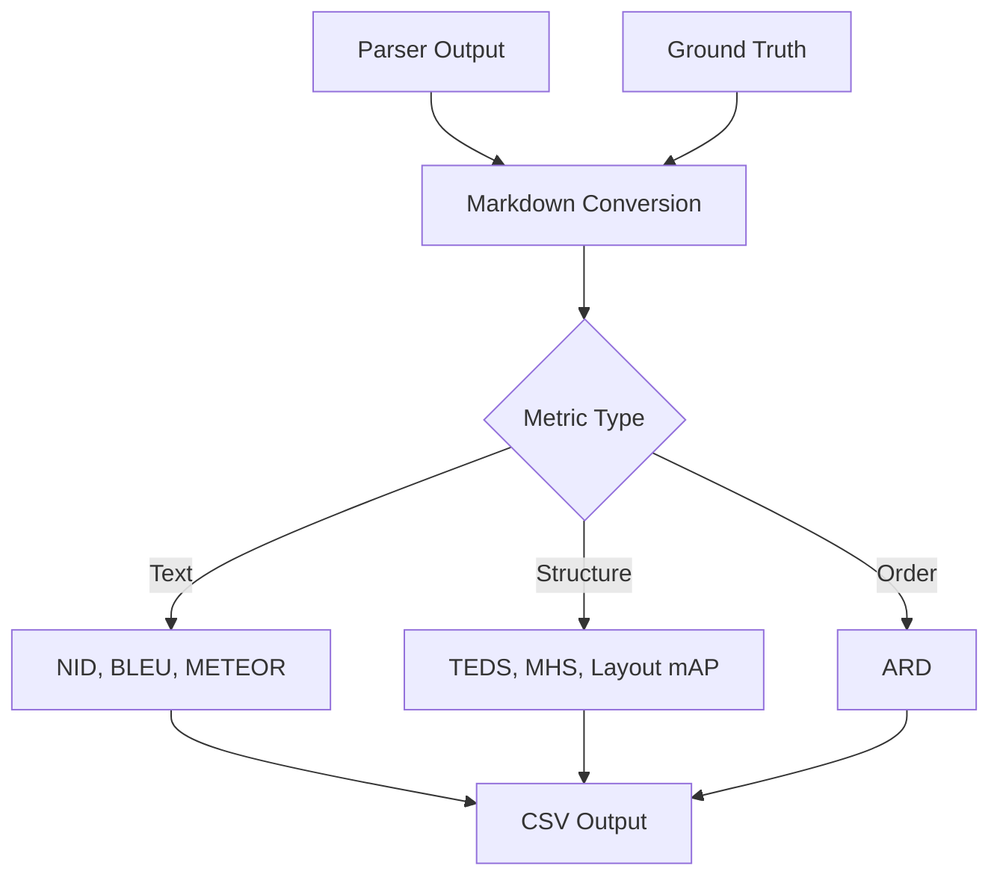

# Metrics Reference

**Status:** Proposed
**Author:** Eval-Harness Team
**Date:** 2025-01-19

## 1. Parsing Metrics

### 1.1 Text Similarity Metrics

#### NID (Normalized Indel Distance)

**Purpose:** Measure text similarity through insertions/deletions.

**Formula:**
```
NID = 1 - (insertions + deletions) / (|gold| + |pred|)
```

**Range:** [0, 1] where 1 = perfect match

**Variants:**
- `nid`: All elements included
- `nid_s`: Sparse elements (tables, equations) excluded

**Use Case:** Overall text extraction quality.

**Implementation:** `rapidfuzz.distance.Levenshtein`

#### BLEU Score

**Purpose:** N-gram overlap between gold and predicted text.

**Formula:**
```
BLEU = BP * exp(sum(wn * log(pn)))
```
where BP = brevity penalty, pn = precision for n-grams

**Range:** [0, 1] where 1 = perfect match

**Use Case:** Machine translation-style text quality.

**Implementation:** `sacrebleu` (direct import, 100x faster than HF)

#### METEOR Score

**Purpose:** Harmonic mean of precision/recall with stemming.

**Range:** [0, 1] where 1 = perfect match

**Use Case:** More forgiving than BLEU for word order variations.

**Implementation:** `nltk.meteor_score`

### 1.2 Structure Metrics

#### TEDS (Tree Edit Distance Similarity)

**Purpose:** Measure table structure similarity.

**Formula:**
```
TEDS = 1 - (edit_distance(T1, T2) / (|T1| + |T2|))
```

**Range:** [0, 1] where 1 = identical structure

**Variants:**
- `teds`: All tables included
- `teds_s`: Non-table elements excluded

**Use Case:** Table extraction quality.

**Implementation:** `apted` (Approximate Tree Edit Distance)

#### MHS (Markdown Hierarchical Similarity)

**Purpose:** Measure heading structure similarity.

**Formula:**
```
MHS = 2 * |intersection| / (|gold_headings| + |pred_headings|)
```

**Range:** [0, 1] where 1 = identical heading hierarchy

**Variants:**
- `mhs`: All elements included
- `mhs_s`: Non-heading elements excluded

**Use Case:** Document structure preservation.

#### Layout mAP

**Purpose:** Mean Average Precision for bounding box detection.

**Formula:** Standard COCO mAP calculation

**Range:** [0, 1] where 1 = perfect localization

**Use Case:** Layout detection accuracy.

**Implementation:** `torchmetrics.detection.mean_ap`

### 1.3 Reading Order Metrics

#### ARD (Average Rank Distance)

**Purpose:** Measure element order displacement.

**Formula:**
```
ARD = (1/n) * Σ(|position_gold(e) - position_pred(e)|)
```

**Range:** [0, ∞) where 0 = perfect order

**Use Case:** Reading order preservation.

**Implementation:** Custom rank comparison

## 2. RAG Metrics

### 2.1 Retrieval Metrics

#### Recall@k

**Purpose:** Did we retrieve any relevant evidence?

**Formula:**
```
Recall@k = 1 if any retrieved chunk overlaps gold spans else 0
```

**Range:** [0, 1] where 1 = found relevant evidence

**Use Case:** Evidence retrieval success.

#### Precision@k

**Purpose:** How precise was retrieval?

**Formula:**
```
Precision@k = relevant_chunks / k
```

**Range:** [0, 1] where 1 = all chunks relevant

**Use Case:** Retrieval precision.

### 2.2 Answer Quality Metrics

#### F1 Score

**Purpose:** Token-level answer quality.

**Formula:**
```
F1 = 2 * precision * recall / (precision + recall)
```

**Range:** [0, 1] where 1 = perfect token match

**Use Case:** Answer completeness.

#### Exact Match

**Purpose:** Strict string matching.

**Formula:**
```
EM = 1 if pred == gold else 0
```

**Range:** {0, 1}

**Use Case:** Strict correctness.

### 2.3 Citation Metrics

#### Answer Supported

**Purpose:** Does answer cite evidence?

**Range:** Boolean (true/false)

**Use Case:** LLM-as-judge or heuristic check.

#### Citation Precision

**Purpose:** Are citations valid?

**Formula:**
```
CitationPrecision = valid_citations / total_citations
```

**Range:** [0, 1] where 1 = all citations valid

**Use Case:** Citation accuracy.

### 2.4 Performance Metrics

#### Latency

**Components:**
- `retrieval_ms`: Time to retrieve chunks
- `generation_ms`: Time to generate answer
- `total_ms`: End-to-end time

**Use Case:** Performance profiling.

## 3. Metric Selection Guide

### 3.1 For Parsing Evaluation

| Goal | Primary Metrics | Secondary Metrics |
|------|-----------------|-------------------|
| Text extraction | NID, NID-S | BLEU, METEOR |
| Table extraction | TEDS, TEDS-S | Layout mAP |
| Document structure | MHS, MHS-S | ARD |
| Reading order | ARD | NID |
| Layout detection | Layout mAP | TEDS |

### 3.2 For RAG Evaluation

| Goal | Primary Metrics | Secondary Metrics |
|------|-----------------|-------------------|
| Retrieval quality | Recall@k, Precision@k | Citation Precision |
| Answer quality | F1 Score | Exact Match |
| Evidence usage | Answer Supported | Citation Precision |
| Performance | total_ms | retrieval_ms, generation_ms |

## 4. Metric Calculation Flow



## 5. Implementation Details

### 5.1 NID Implementation

```python
from rapidfuzz.distance import Levenshtein

def calculate_nid(gold: str, pred: str) -> float:
    distance = Levenshtein.distance(gold, pred)
    total_len = len(gold) + len(pred)
    if total_len == 0:
        return 1.0
    return 1.0 - (distance / total_len)
```

### 5.2 TEDS Implementation

```python
from apted import APTED
from apted.helpers import Tree

def calculate_teds(gold_tree: Tree, pred_tree: Tree) -> float:
    distance = APTED(gold_tree, pred_tree).compute_edit_distance()
    total_size = len(gold_tree) + len(pred_tree)
    if total_size == 0:
        return 1.0
    return 1.0 - (distance / total_size)
```

### 5.3 Recall@k Implementation

```python
def calculate_recall_at_k(
    gold_spans: list[list[int]],
    retrieved_chunks: list[dict],
) -> float:
    for chunk in retrieved_chunks:
        chunk_span = chunk.get("char_span", [])
        if len(chunk_span) != 2:
            continue
        chunk_start, chunk_end = chunk_span
        
        for gold_start, gold_end in gold_spans:
            overlap_start = max(chunk_start, gold_start)
            overlap_end = min(chunk_end, gold_end)
            
            if overlap_start < overlap_end:
                return 1.0  # Found relevant evidence
    return 0.0
```

## 6. Related Documents

- [001-Architecture-Overview](001-architecture-overview.md)
- [002-Data-Flow-Detailed](002-data-flow-detailed.md)
- [003-Schema-Design](003-schema-design.md)
