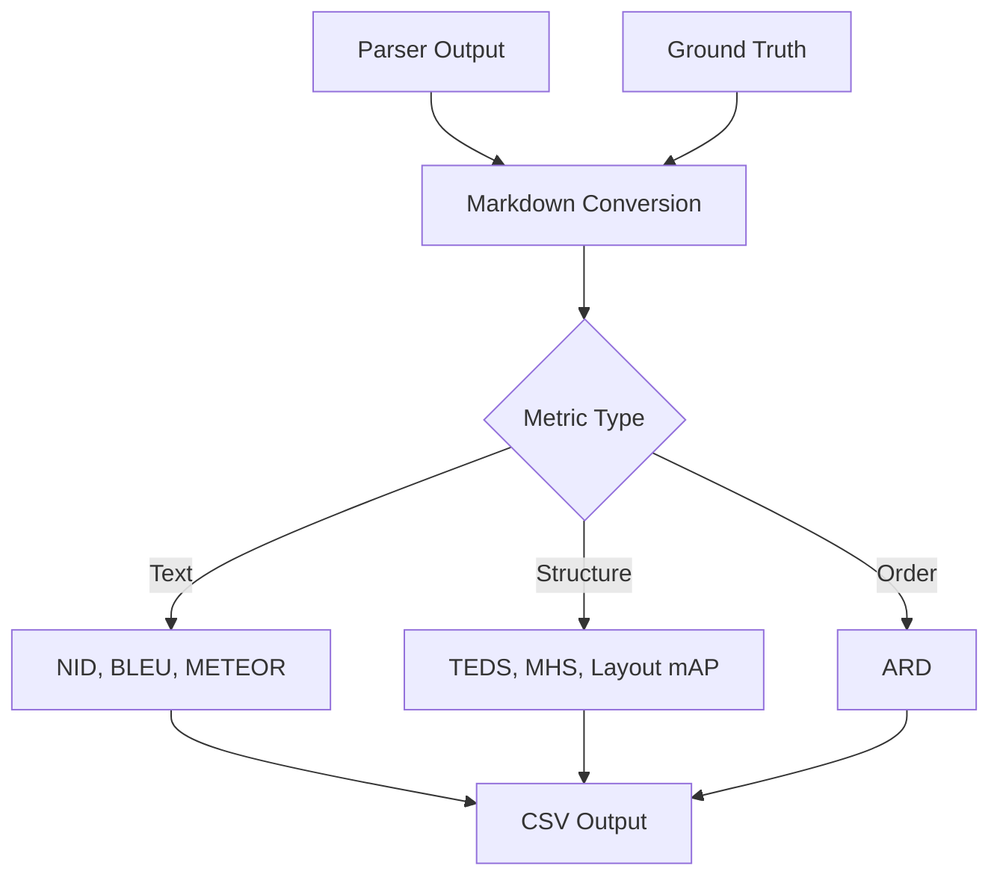

# Metrics Reference

**Status:** Proposed
**Author:** Eval-Harness Team
**Date:** 2025-01-19

## 1. Parsing Metrics

Metrics for evaluating document parsing quality. Each measures a different aspect of extraction accuracy.

### 1.1 Text Similarity

**NID (Normalized Indel Distance)**

Measures text similarity by counting insertions and deletions needed to transform gold text into predicted text.

- **Range**: 0 to 1, where 1 is perfect match
- **Variants**:
  - `nid`: includes all elements
  - `nid_s`: excludes sparse elements (tables, equations) for fairer comparison
- **Use case**: Overall text extraction quality

**BLEU Score**

Measures n-gram overlap between gold and predicted text. Originally from machine translation.

- **Range**: 0 to 1, where 1 is perfect match
- **Use case**: Translation-style text quality assessment

**METEOR Score**

Harmonic mean of precision and recall with stemming. More forgiving than BLEU for word order variations.

- **Range**: 0 to 1, where 1 is perfect match
- **Use case**: When word order matters less than content

### 1.2 Structure

**TEDS (Tree Edit Distance Similarity)**

Measures table structure similarity by counting edits needed to transform gold table tree into predicted table tree.

- **Range**: 0 to 1, where 1 is identical structure
- **Variants**:
  - `teds`: includes all tables
  - `teds_s`: excludes non-table elements
- **Use case**: Table extraction quality

**MHS (Markdown Hierarchical Similarity)**

Measures heading structure similarity by comparing heading hierarchies.

- **Range**: 0 to 1, where 1 is identical heading hierarchy
- **Variants**:
  - `mhs`: includes all elements
  - `mhs_s`: excludes non-heading elements
- **Use case**: Document structure preservation

**Layout mAP**

Mean Average Precision for bounding box detection. Standard COCO metric adapted for document layout.

- **Range**: 0 to 1, where 1 is perfect localization
- **Use case**: Layout detection accuracy

### 1.3 Reading Order

**ARD (Average Rank Distance)**

Measures how far elements are from their correct reading order position.

- **Range**: 0 to infinity, where 0 is perfect order
- **Use case**: Reading order preservation

## 2. RAG Metrics

Metrics for evaluating retrieval-augmented generation systems.

### 2.1 Retrieval Quality

**Recall@k**

Binary metric: did the system retrieve any relevant evidence?

- **Range**: 0 or 1
- **Calculation**: 1 if any retrieved chunk overlaps gold evidence spans, else 0
- **Use case**: Evidence retrieval success

**Precision@k**

What fraction of retrieved chunks were actually relevant?

- **Range**: 0 to 1
- **Calculation**: relevant chunks divided by k (number retrieved)
- **Use case**: Retrieval precision assessment

### 2.2 Answer Quality

**F1 Score**

Token-level harmonic mean of precision and recall for answer correctness.

- **Range**: 0 to 1, where 1 is perfect token match
- **Use case**: Answer completeness assessment

**Exact Match**

Strict binary metric: exact string match between predicted and gold answer.

- **Range**: 0 or 1
- **Use case**: Strict correctness requirement

### 2.3 Citation Quality

**Answer Supported**

Does the answer actually cite evidence from retrieved context? Judged by LLM (via Bedrock Claude) or heuristic.

- **Range**: true or false
- **Use case**: Groundedness verification

**Citation Precision**

What fraction of citations are valid (actually support the claim)?

- **Range**: 0 to 1, where 1 means all citations are valid
- **Calculation**: valid citations divided by total citations
- **Use case**: Citation accuracy assessment

### 2.4 Performance

**Latency Breakdown**

Three timing measurements for performance profiling:

- `retrieval_ms`: time to retrieve chunks
- `generation_ms`: time to generate answer
- `total_ms`: end-to-end latency

## 3. Metric Selection Guide

### 3.1 Parsing Evaluation

| Goal | Primary Metrics | Secondary Metrics |
|------|-----------------|-------------------|
| Text extraction | NID, NID-S | BLEU, METEOR |
| Table extraction | TEDS, TEDS-S | Layout mAP |
| Document structure | MHS, MHS-S | ARD |
| Reading order | ARD | NID |
| Layout detection | Layout mAP | TEDS |

### 3.2 RAG Evaluation

| Goal | Primary Metrics | Secondary Metrics |
|------|-----------------|-------------------|
| Retrieval quality | Recall@k, Precision@k | Citation Precision |
| Answer quality | F1 Score | Exact Match |
| Evidence usage | Answer Supported | Citation Precision |
| Performance | total_ms | retrieval_ms, generation_ms |

## 4. Metric Calculation Flow

## 5. How Metrics Work

### 5.1 NID Calculation

Count insertions and deletions to transform gold text into predicted text. Divide by total length. Subtract from 1.

Higher values mean fewer edits needed (better).

### 5.2 TEDS Calculation

Compute tree edit distance between gold and predicted table structures. Divide by total tree size. Subtract from 1.

Higher values mean more similar table structures (better).

### 5.3 Recall@k Calculation

Check each retrieved chunk's character span against gold evidence spans. If any overlap, recall is 1.

Binary metric: either found evidence or didn't.

## 6. Related Documents

- [001-Architecture-Overview](001-architecture-overview.md)
- [002-Data-Flow-Detailed](002-data-flow-detailed.md)
- [003-Schema-Design](003-schema-design.md)
