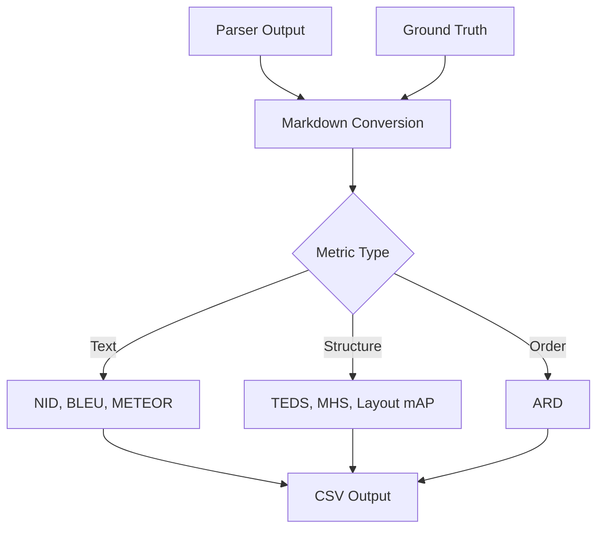

# Metrics Reference

## 1. Parsing Metrics

Metrics for evaluating document parsing quality. Each measures a different aspect of extraction accuracy.

### 1.1 Text Similarity

**NID (Normalized Indel Distance)**

Measures text similarity by counting insertions and deletions needed to transform gold text into predicted text.

- **Range**: 0 to 1, where 1 is perfect match
- **Variants**:
  - `nid`: includes all elements
  - `nid_s`: excludes sparse elements (tables, equations) for fairer comparison
- **Use case**: Overall text extraction quality

**BLEU Score**

Measures n-gram overlap between gold and predicted text. Originally from machine translation.

- **Range**: 0 to 1, where 1 is perfect match
- **Use case**: Translation-style text quality assessment

**METEOR Score**

Harmonic mean of precision and recall with stemming. More forgiving than BLEU for word order variations.

- **Range**: 0 to 1, where 1 is perfect match
- **Use case**: When word order matters less than content

### 1.2 Structure

**TEDS (Tree Edit Distance Similarity)**

Measures table structure similarity by counting edits needed to transform gold table tree into predicted table tree.

- **Range**: 0 to 1, where 1 is identical structure
- **Variants**:
  - `teds`: includes all tables
  - `teds_s`: excludes non-table elements
- **Use case**: Table extraction quality

**MHS (Markdown Hierarchical Similarity)**

Measures heading structure similarity by comparing heading hierarchies.

- **Range**: 0 to 1, where 1 is identical heading hierarchy
- **Variants**:
  - `mhs`: includes all elements
  - `mhs_s`: excludes non-heading elements
- **Use case**: Document structure preservation

**Layout mAP**

Mean Average Precision for bounding box detection. Standard COCO metric adapted for document layout.

- **Range**: 0 to 1, where 1 is perfect localization
- **Use case**: Layout detection accuracy

### 1.3 Reading Order

**ARD (Average Rank Distance)**

Measures how far elements are from their correct reading order position.

- **Range**: 0 to infinity, where 0 is perfect order
- **Use case**: Reading order preservation

## 2. Legal RAG Bench Metrics

Metrics for Legal RAG Bench evaluation using DeepEval/RAGAS framework. LLM-as-judge approach via OpenAI or AWS Bedrock.

### 2.1 Faithfulness

**Component Evaluated**: Generator (LLM)

**Definition**: Measures factual consistency of generated response against retrieved context.

**How it works**:
1. Breaks generated answer into individual claims
2. Uses LLM judge to verify each claim against retrieved context
3. Calculates ratio of supported claims to total claims

**Formula**:
```
Faithfulness = (Claims supported by context) / (Total claims)
```

**Range**: 0.0 to 1.0

**Use case**: Hallucination detection, answer groundedness verification

**What it catches**: Hallucinations, invented facts, information not in context

### 2.2 Context Precision

**Component Evaluated**: Retriever

**Definition**: Evaluates retriever's ability to rank relevant chunks higher than irrelevant ones.

**How it works**:
1. Uses LLM to judge each retrieved chunk's relevance to the question
2. Calculates precision@k for each position
3. Computes mean precision weighted by relevance

**Formula**:
```
Context Precision@K = Σ(Precision@k × v_k) / (Total relevant items)
where Precision@k = (relevant items at rank k) / k
```

**Range**: 0.0 to 1.0

**Use case**: Retrieval ranking quality, signal-to-noise assessment

**What it catches**: Poor ranking, noise in retrieval, irrelevant chunks at top positions

**Key insight**: Order matters! Irrelevant chunk at position 1 hurts more than at position 5.

### 2.3 Context Recall

**Component Evaluated**: Retriever

**Definition**: Measures how many relevant documents were successfully retrieved.

**How it works**:
1. Breaks reference (gold) answer into claims
2. Uses LLM to check if each claim can be attributed to retrieved context
3. Calculates ratio of supported claims to total claims

**Formula**:
```
Context Recall = (Claims in reference supported by context) / (Total claims in reference)
```

**Range**: 0.0 to 1.0

**Use case**: Coverage assessment, completeness of retrieval

**What it catches**: Missing information, incomplete retrieval

**Requires**: Ground truth reference answer

### 2.4 Answer Relevancy

**Component Evaluated**: End-to-end (Retriever + Generator)

**Definition**: Measures how relevant the response is to the original question.

**How it works**:
1. Generates N artificial questions FROM the answer
2. Computes cosine similarity between generated questions and original question
3. Returns mean similarity score

**Formula**:
```
Answer Relevancy = (1/N) × Σ(cosine_similarity(generated_question_embedding, original_question_embedding))
```

**Range**: 0.0 to 1.0

**Use case**: Response quality, evasion detection

**What it catches**: Evasive answers, "I don't know" responses, incomplete answers

### 2.5 Relevant Passage Retrieved

**Component Evaluated**: Retriever

**Definition**: Binary metric: was the gold-standard passage ID found in retrieved context?

**Range**: true or false

**Use case**: Quick retrieval success check

**Legal RAG Bench specific**: Each question has a `relevant_passage_id` in the dataset.

## 3. General RAG Metrics

Traditional RAG metrics for non-Legal-RAG-Bench evaluation.

### 3.1 Retrieval Quality

**Recall@k**

Binary metric: did the system retrieve any relevant evidence?

- **Range**: 0 or 1
- **Calculation**: 1 if any retrieved chunk overlaps gold evidence spans, else 0
- **Use case**: Evidence retrieval success

**Precision@k**

What fraction of retrieved chunks were actually relevant?

- **Range**: 0 to 1
- **Calculation**: relevant chunks divided by k (number retrieved)
- **Use case**: Retrieval precision assessment

### 2.2 Answer Quality

**F1 Score**

Token-level harmonic mean of precision and recall for answer correctness.

- **Range**: 0 to 1, where 1 is perfect token match
- **Use case**: Answer completeness assessment

**Exact Match**

Strict binary metric: exact string match between predicted and gold answer.

- **Range**: 0 or 1
- **Use case**: Strict correctness requirement

### 2.3 Citation Quality

**Answer Supported**

Does the answer actually cite evidence from retrieved context? Judged by LLM (via Bedrock Claude) or heuristic.

- **Range**: true or false
- **Use case**: Groundedness verification

**Citation Precision**

What fraction of citations are valid (actually support the claim)?

- **Range**: 0 to 1, where 1 means all citations are valid
- **Calculation**: valid citations divided by total citations
- **Use case**: Citation accuracy assessment

### 2.4 Performance

**Latency Breakdown**

Three timing measurements for performance profiling:

- `retrieval_ms`: time to retrieve chunks
- `generation_ms`: time to generate answer
- `total_ms`: end-to-end latency

## 4. Metric Selection Guide

### 4.1 Parsing Evaluation

| Goal | Primary Metrics | Secondary Metrics |
|------|-----------------|-------------------|
| Text extraction | NID, NID-S | BLEU, METEOR |
| Table extraction | TEDS, TEDS-S | Layout mAP |
| Document structure | MHS, MHS-S | ARD |
| Reading order | ARD | NID |
| Layout detection | Layout mAP | TEDS |

### 4.2 Legal RAG Bench Evaluation

| Goal | Primary Metrics | Secondary Metrics |
|------|-----------------|-------------------|
| Retrieval ranking | Context Precision | Relevant Passage Retrieved |
| Retrieval coverage | Context Recall | Relevant Passage Retrieved |
| Answer groundedness | Faithfulness | Answer Relevancy |
| Response quality | Answer Relevancy | Faithfulness |
| Overall system | All four | Binary passage check |

### 4.3 General RAG Evaluation

| Goal | Primary Metrics | Secondary Metrics |
|------|-----------------|-------------------|
| Retrieval quality | Recall@k, Precision@k | Citation Precision |
| Answer quality | F1 Score | Exact Match |
| Evidence usage | Answer Supported | Citation Precision |
| Performance | total_ms | retrieval_ms, generation_ms |

## 5. Metric Calculation Flow



## 6. How Metrics Work

### 6.1 NID Calculation

Count insertions and deletions to transform gold text into predicted text. Divide by total length. Subtract from 1.

Higher values mean fewer edits needed (better).

### 6.2 TEDS Calculation

Compute tree edit distance between gold and predicted table structures. Divide by total tree size. Subtract from 1.

Higher values mean more similar table structures (better).

### 6.3 Recall@k Calculation

Check each retrieved chunk's character span against gold evidence spans. If any overlap, recall is 1.

Binary metric: either found evidence or didn't.

## 7. Related Documents

- [001-Architecture-Overview](001-architecture-overview.md)
- [002-Data-Flow-Detailed](002-data-flow-detailed.md)
- [003-Schema-Design](003-schema-design.md)
