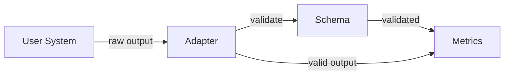

# Adapter Implementation Guide

**Status:** Proposed
**Author:** Eval-Harness Team
**Date:** 2025-01-19

## 1. Purpose

This guide explains how to implement adapters for integrating custom parsers and RAG systems with eval-harness.

## 2. Adapter Pattern Overview

### 2.1 Problem Solved

Different systems produce different output formats. The adapter pattern:
- **Zero modifications** to user code
- **Single metrics implementation** for all systems
- **Schema validation** catches errors early

### 2.2 Architecture



## 3. Parser Adapter

### 3.1 Interface

```python
from pathlib import Path
from typing import Any, Callable

ParseCallable = Callable[[Path], dict[str, Any]]

class ParserAdapter:
    def __init__(self, parse_callable: ParseCallable | None = None) -> None:
        if parse_callable is None:
            from eval_harness.stubs.stub_parser import parse
            self._parse = parse
        else:
            self._parse = parse_callable
    
    def parse(self, pdf_path: Path) -> dict[str, Any]:
        output = self._parse(pdf_path)
        schema_validate(output, Path("contracts/parser_output.schema.json"))
        return output
```

### 3.2 Implementing a Custom Parser

**Step 1:** Write your parse function
```python
def my_parser(pdf_path: Path) -> dict:
    # Your existing parser code
    result = parse_pdf(pdf_path)
    return {
        "pages": result.pages,
        "elements": result.elements,
        # ... any format
    }
```

**Step 2:** Create adapter
```python
from eval_harness.adapters.parser_adapter import ParserAdapter

adapter = ParserAdapter(my_parser)
output = adapter.parse(Path("document.pdf"))
# output guaranteed to validate against schema
```

**Step 3:** Write conversion function (if needed)
```python
def convert_to_eval_harness(your_output: dict, pdf_path: Path) -> dict:
    elements = []
    char_offset = 0
    
    for item in your_output["elements"]:
        elements.append({
            "element_id": f"{pdf_path.stem}_{len(elements)}",
            "type": map_type(item["type"]),
            "page_index": item.get("page", 0),
            "char_span": [char_offset, char_offset + len(item["text"])],
            "text": item["text"],
            "content": {"kind": "text"}
        })
        char_offset += len(item["text"])
    
    return {
        "schema_version": "1.0.0",
        "parser_version": "1.0.0",
        "source": {
            "doc_id": pdf_path.stem,
            "filename": pdf_path.name,
            "mime_type": "application/pdf"
        },
        "pages": your_output.get("pages", []),
        "elements": elements
    }

def map_type(your_type: str) -> str:
    mapping = {
        "heading": "heading",
        "body": "paragraph",
        "table": "table"
    }
    return mapping.get(your_type, "paragraph")
```

### 3.3 Minimal Adapter Example

```python
from pathlib import Path
from eval_harness.adapters.parser_adapter import ParserAdapter

def minimal_parser(pdf_path: Path) -> dict:
    """Minimal adapter for text-only evaluation."""
    from pypdf import PdfReader
    
    reader = PdfReader(pdf_path)
    text = ""
    for page in reader.pages:
        text += page.extract_text()
    
    return {
        "schema_version": "1.0.0",
        "parser_version": "1.0.0",
        "source": {
            "doc_id": pdf_path.stem,
            "filename": pdf_path.name,
            "mime_type": "application/pdf"
        },
        "pages": [{"page_index": 0, "width": 612, "height": 792}],
        "elements": [{
            "element_id": "elem_0",
            "type": "paragraph",
            "text": text,
            "page_index": 0,
            "char_span": [0, len(text)],
            "content": {"kind": "text"}
        }]
    }

adapter = ParserAdapter(minimal_parser)
```

## 4. RAG Adapter

### 4.1 Interface

```python
from pathlib import Path
from typing import Any, Callable

QueryCallable = Callable[[str, Path], dict[str, Any]]

class RagAdapter:
    def __init__(self, query_callable: QueryCallable | None = None) -> None:
        if query_callable is None:
            from eval_harness.stubs.stub_ingestion import query
            self._query = query
        else:
            self._query = query_callable
    
    def query(self, question: str, corpus_dir: Path) -> dict[str, Any]:
        output = self._query(question, corpus_dir)
        schema_validate(output, Path("contracts/rag_query_output.schema.json"))
        return output
```

### 4.2 Implementing a Custom RAG System

**Step 1:** Write your query function
```python
def my_rag_query(question: str, corpus_dir: Path) -> dict:
    # Your existing RAG code
    chunks = retrieve(question, corpus_dir)
    answer = generate(question, chunks)
    
    return {
        "answer": answer,
        "retrieved": chunks,
        # ... any format
    }
```

**Step 2:** Create adapter
```python
from eval_harness.adapters.rag_adapter import RagAdapter

adapter = RagAdapter(my_rag_query)
output = adapter.query("What is this?", Path("corpus"))
# output guaranteed to validate against schema
```

**Step 3:** Write conversion function (if needed)
```python
def convert_to_eval_harness(
    question: str,
    corpus_dir: Path,
    your_retrieved: list,
    your_answer: str,
) -> dict:
    # Build retrieved chunks
    retrieved_chunks = []
    for item in your_retrieved:
        retrieved_chunks.append({
            "chunk_id": item["id"],
            "score": item["score"],
            "char_span": item.get("span", [0, 100])
        })
    
    # Build answer
    answer = {
        "text": your_answer,
        "answer_supported": True,  # or your judgment
        "citations": [{"chunk_ids": [c["chunk_id"] for c in retrieved_chunks[:3]]}]
    }
    
    return {
        "answer": answer,
        "retrieved_chunks": retrieved_chunks,
        "timings_ms": {
            "retrieval": 50,
            "generation": 500,
            "total": 550
        }
    }
```

### 4.3 Minimal RAG Adapter Example

```python
from pathlib import Path
from eval_harness.adapters.rag_adapter import RagAdapter

def minimal_rag_query(question: str, corpus_dir: Path) -> dict:
    """Minimal RAG for demonstration."""
    import time
    
    start = time.time()
    
    # Dummy retrieval
    chunks = [
        {"chunk_id": "doc1_chunk1", "score": 0.8, "char_span": [0, 100]},
        {"chunk_id": "doc1_chunk2", "score": 0.6, "char_span": [100, 200]},
    ]
    
    retrieval_ms = int((time.time() - start) * 1000)
    
    # Dummy generation
    answer = f"Based on the documents, the answer is: {question}"
    generation_ms = 100
    
    return {
        "answer": {
            "text": answer,
            "answer_supported": False,
            "citations": []
        },
        "retrieved_chunks": chunks,
        "timings_ms": {
            "retrieval": retrieval_ms,
            "generation": generation_ms,
            "total": retrieval_ms + generation_ms
        }
    }

adapter = RagAdapter(minimal_rag_query)
```

## 5. Schema Validation

### 5.1 Validation Points

Validation happens in the adapter before returning to framework:

```python
def parse(self, pdf_path: Path) -> dict[str, Any]:
    output = self._parse(pdf_path)
    schema_validate(output, schema_path)  # May raise
    return output
```

### 5.2 Error Handling

```python
try:
    output = adapter.parse(pdf_path)
except SchemaValidationError as e:
    # Clear error message
    print(f"Validation failed: {e.message}")
    print(f"Path: {e.path}")
    # Fix your output format
```

### 5.3 Common Validation Errors

| Error | Cause | Fix |
|-------|-------|-----|
| Missing required field | `element_id` not provided | Add all required fields |
| Wrong type | `page_index` is string not int | Use correct types |
| Invalid enum | `type` = "heading" not "h1" | Use standard types |
| Invalid char_span | `[start]` instead of `[start, end]` | Use 2-element array |

## 6. Integration Patterns

### 6.1 Direct Function Integration

```python
# Your existing function
def my_parse_function(pdf_path: str) -> dict:
    ...

# Wrap and use
adapter = ParserAdapter(lambda p: my_parse_function(str(p)))
```

### 6.2 Class-based Integration

```python
class MyParser:
    def parse(self, pdf_path: Path) -> dict:
        ...

parser = MyParser()
adapter = ParserAdapter(parser.parse)
```

### 6.3 Module-based Integration

```python
# my_module/adapter.py
def query(question: str, corpus_dir: Path) -> dict:
    ...

# In runner
from my_module.adapter import query
adapter = RagAdapter(query)
```

## 7. Testing Your Adapter

### 7.1 Unit Test

```python
import pytest
from pathlib import Path

def test_parser_adapter():
    adapter = ParserAdapter(my_parser)
    output = adapter.parse(Path("test.pdf"))
    
    # Verify schema compliance
    assert "elements" in output
    assert "schema_version" in output
    
    # Verify specific fields
    assert len(output["elements"]) > 0
    assert output["elements"][0]["element_id"] is not None
```

### 7.2 Schema Test

```python
def test_schema_validation():
    from jsonschema import validate
    
    adapter = ParserAdapter(my_parser)
    output = adapter.parse(Path("test.pdf"))
    
    # Load schema
    with open("contracts/parser_output.schema.json") as f:
        schema = json.load(f)
    
    # Should not raise
    validate(instance=output, schema=schema)
```

## 8. Best Practices

1. **Always validate:** Don't skip schema validation
2. **Use type hints:** Helps catch errors early
3. **Provide versions:** Include `parser_version` for tracking
4. **Handle errors gracefully:** Return meaningful error messages
5. **Test with known documents:** Verify consistent output
6. **Document your types:** If using custom element types, document mapping

## 9. Related Documents

- [001-Architecture-Overview](001-architecture-overview.md)
- [003-Schema-Design](003-schema-design.md)
- [004-Metrics-Reference](004-metrics-reference.md)
