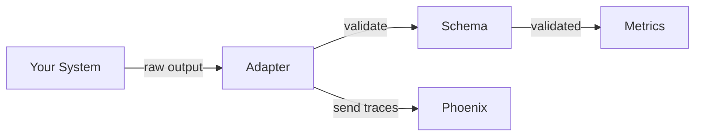

# Adapter Implementation Guide

## 1. Purpose

This guide explains how to integrate your custom parser or RAG system with eval-harness using adapters.

## 2. Adapter Pattern Overview

### 2.1 Problem Solved

Different systems produce different output formats. The adapter pattern:

- **Zero modifications** to your code
- **Single metrics implementation** for all systems
- **Schema validation** catches errors early

### 2.2 Architecture

The adapter sits between your system and the evaluation framework. It validates your output, sends telemetry to Phoenix, and passes validated data to metrics calculation.

## 3. Parser Adapter

### 3.1 How It Works

Your parser function takes a PDF path and returns a dictionary. The adapter wraps this function, validates the output against the schema, and emits telemetry.

You don't need to modify your parser code. Just wrap it.

### 3.2 Integration Steps

**Step 1: Write your parse function**

Create a function that takes a file path and returns your parser's output in whatever format it naturally produces.

**Step 2: Create the adapter**

Pass your function to `ParserAdapter`. The adapter will call your function, validate the output, and handle schema errors.

**Step 3: Run evaluation**

Call `adapter.parse()` with a PDF path. Output is guaranteed to validate against the schema.

### 3.3 Output Format

If your parser already outputs the standard schema format, no conversion needed. If not, write a thin conversion layer that maps your fields to the standard schema:

- `schema_version`, `parser_version`: version strings
- `source`: document metadata (ID, filename, MIME type)
- `pages`: array of page objects with dimensions
- `elements`: array of extracted elements with type, text, position

### 3.4 Element Types

Standard element types: `paragraph`, `heading`, `table`, `list`, `figure`, `equation`, `page_break`. Map your types to these.

### 3.5 Minimal Example

Simplest possible adapter: extract all text as one paragraph element. Useful for quick testing or text-only evaluation.

## 4. RAG Adapter

### 4.1 How It Works

Your RAG query function takes a question and corpus directory, returns retrieved chunks and generated answer. The adapter validates output and emits telemetry to Phoenix.

### 4.2 Integration Steps

**Step 1: Write your query function**

Create a function that takes a question and corpus directory, returns your RAG system's output.

**Step 2: Create the adapter**

Pass your function to `RagAdapter`. Adapter validates output and handles schema errors.

**Step 3: Run evaluation**

Call `adapter.query()` with a question and corpus path.

### 4.3 Output Format

Standard RAG output requires:

- `answer`: object with `text`, `answer_supported` (boolean), optional `citations`
- `retrieved_chunks`: array with `chunk_id`, `score`, optional `char_span`
- `timings_ms`: object with `retrieval`, `generation`, `total` times

If your system outputs different fields, write a conversion layer.

### 4.4 LLM-as-Judge

For RAG evaluation, the framework can use Anthropic Claude via Amazon Bedrock to judge:

- **Answer supported**: Does the answer cite retrieved evidence?
- **Citation quality**: Are citations valid and relevant?

This provides more nuanced assessment than heuristic rules.

### 4.5 Minimal Example

Simplest possible adapter: return dummy retrieved chunks and a templated answer. Useful for testing the evaluation pipeline.

## 5. Schema Validation

### 5.1 When Validation Happens

Validation occurs in the adapter before returning to the framework. If validation fails:

- Error is recorded in Phoenix
- Clear error message points to specific field
- Evaluation continues with next document

### 5.2 Common Validation Errors

| Error | Cause | Fix |
|-------|-------|-----|
| Missing required field | Required field not provided | Add all required fields from schema |
| Wrong type | String instead of integer | Use correct types |
| Invalid enum value | Unknown element type | Use standard type names |
| Invalid span format | Single number instead of array | Use `[start, end]` format |

### 5.3 Validation Benefits

- **Fail fast**: Catch errors immediately, not after metrics calculation
- **Clear errors**: Know exactly which field is wrong
- **Framework isolation**: Your bugs don't crash the evaluation

## 6. Telemetry with Arize Phoenix

### 6.1 Automatic Tracing

Adapters automatically emit OpenTelemetry traces to Phoenix:

- Parse/query latency
- Validation success/failure
- Metric calculation time
- LLM judge calls (for RAG)

### 6.2 Span Attributes

Each trace includes useful attributes for debugging:

- Document ID or query ID
- Parser or RAG system name
- Schema version
- Error details (if validation failed)

### 6.3 Viewing Traces

Access traces via:
- Phoenix UI: localhost:6006 (local) or cloud URL
- Query by trace_id or job_id
- CloudWatch Logs integration

## 7. Integration Patterns

### 7.1 Direct Function

Pass any function matching the signature directly to the adapter.

### 7.2 Class Method

If your parser is a class with a `parse` method, pass the method reference.

### 7.3 Lambda Wrapper

For minor signature mismatches, use a lambda to adapt your function.

## 8. Testing Your Adapter

### 8.1 Unit Testing

Test that your adapter produces valid output:

- Check required fields present
- Verify field types correct
- Validate against schema directly

### 8.2 Integration Testing

Run evaluation on small dataset:

- Verify CSV output generated
- Check Phoenix traces visible
- Confirm metrics calculated

### 8.3 Error Handling

Test with invalid input:

- Missing PDF file
- Malformed document
- Empty results

Verify adapter handles gracefully.

## 9. Cloud Deployment

### 9.1 Container Requirements

For EKS deployment, package your adapter with the eval-harness container. Dependencies specified in `pyproject.toml`.

### 9.2 IAM Permissions

Ensure your pod/role has permissions for:

- S3: read datasets, write results
- Bedrock: invoke Claude model (for LLM-as-judge)
- CloudWatch: write logs

### 9.3 Configuration

Dataset paths and Phoenix endpoint configured via environment variables or `eval_config.yaml` in S3.

## 10. Best Practices

1. **Don't skip validation**: Catches errors early
2. **Include versions**: Track parser/RAG version for regression detection
3. **Handle errors gracefully**: Return meaningful error messages
4. **Test on known documents**: Verify consistent output
5. **Check Phoenix traces**: Use telemetry for debugging
6. **Document type mappings**: If using custom element types, document the mapping

## 11. Related Documents

- [001-Architecture-Overview](001-architecture-overview.md)
- [003-Schema-Design](003-schema-design.md)
- [004-Metrics-Reference](004-metrics-reference.md)
